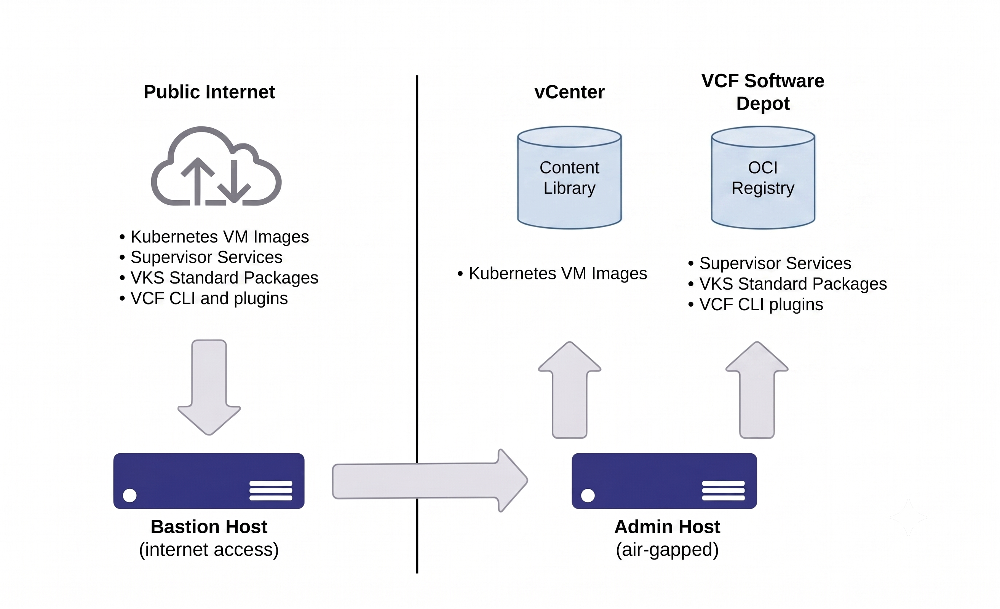

# VKS Deployment Guide for VCF 9.1.1+ air-gapped environments

## Introduction
vSphere Kubernetes Service (VKS) is the Kubernetes service that runs on top of vSphere Supervisor in VCF (VMware Cloud Foundation) and VVF (VMware vSphere Foundation) deployments. This guide describes the end-to-end procedure for deploying VKS clusters, Supervisor Services, and VKS Standard Packages in an air-gapped environment that has no direct internet access.

The procedure involves the following major steps:

1. Download the required files, binaries, and images on an internet-connected Bastion host and transfer them to the air-gapped environment.
2. Configure the Admin host and upload all artifacts (Kubernetes releases, VCF CLI and plugins, Supervisor Services, VKS Standard Packages) to the Software Depot.
3. Enable Supervisor on a vCenter in the air-gapped environment.
4. Create or verify a Kubernetes release content library subscribed to the Software Depot.
5. Create vSphere Namespace(s) for the VKS clusters.
6. Install kubectl and the VCF CLI on the Admin host and log in to the Supervisor.
7. Install and configure Harbor on the Supervisor.
8. Deploy the VKS cluster(s) and the VKS Standard Packages.

The data flow of packages, binaries, and images between the internet-connected and air-gapped environments is summarized in the diagram below.



## Terminology
* **Bastion host** &mdash; A Windows or Linux host that is connected to the Internet, or has access to download packages, binaries, and images from the Internet.
* **Admin host** &mdash; A host (typically a Linux VM) inside the air-gapped environment with no internet access. The Admin host has network connectivity to all hosts in the air-gapped environment. Files downloaded on the Bastion host are transferred to the Admin host, and administrators use the Admin host to interact with the platform.
* **VCF CLI** &mdash; The plugin-based CLI used to interact with Supervisor and VKS clusters.
* **VKS Standard Packages** &mdash; A curated set of services and add-ons (for example, cert-manager, Contour, Prometheus, Grafana) that administrators and users can install and manage on VKS clusters using the VCF CLI or relevant add-ons APIs.

## Prerequisites
* This guide applies to VCF / VVF 9.1.1 or later deployments. The VCF Download Tool is used to download non-OCI artifacts and OCI images of Supervisor, Supervisor Services, VKS Standard Packages, VCF CLI and plugins and upload them to Software depot.
* For VCF / VVF deployments based on release 9.1.0, the OCI registry in VCF Software Depot is used as the OCI-compliant registry that hosts the OCI images for Supervisor Services and VKS Standard Packages; please follow this [VKS Deployment Guide for VCF 9.1.0 air-gapped environments](/airgapped/air-gapped-vcf91.md) instead.
* For VCF / VVF deployments based on releases earlier than 9.1.0, an external OCI-compliant registry is required; please follow the legacy [VKS Deployment Guide for air-gapped environments](/airgapped/air-gapped.md) instead.

## Bill of Materials
The table below provides sample hostnames and versions used throughout the document for easy reference -

|Component|Version|Sample Hostname (where applicable)|
|---------|-------|----------------------------------|
|Bastion Host|Windows or Linux|bastion.internet.lab.test|
|Admin Host (air-gapped)|Ubuntu 24.04.4 (identical to the Bastion Host)|admin.env1.lab.test|
|vCenter|9.1.1|vcenter.env1.lab.test|
|ESXi|9.1.1|esxi[0..xxx].env1.lab.test|
|Supervisor|9.1.1|supervisor0.env1.lab.test|
|VKS cluster|1.34.2|workload-vsphere-vks1|
|VKS Standard Packages|3.7.0-20260618||
|VKS Service|3.7.0||

In addition, the following packages and binaries should be installed on both the Bastion host and the Admin host:

* `wget`
* `curl`
* `ssh` and `sshpass`
* `docker` (preferably from the official Docker website &mdash; https://docs.docker.com/engine/install/)
* `jq`
* `yq` (some Linux distributions ship an older or alternative implementation of `yq`; the latest release is available at https://github.com/mikefarah/yq/releases)
* `openssl` for certificate generation and validation
* `vcf-download-tool` for downloading and uploading VCF artifacts &mdash; download from the **VCF Lifecycle Management** page on the [Broadcom Support Portal](https://support.broadcom.com). The tool is self-contained with no additional dependencies and supports both Windows and Linux.
* Additional troubleshooting and diagnostic tools as needed.

## 1. Download all required plugins, binaries, and images
This stage uses the Bastion host (**bastion.internet.lab.test**), which can run Windows or Linux. The following plugins, binaries, and packages must be downloaded; each plays a role in the platform deployment process.

### 1a. VMware vSphere Kubernetes release OVA files
VMware vSphere Kubernetes releases (VKrs) provide the Kubernetes software distribution for VKS clusters. VMware distributes Kubernetes releases as virtual machine templates, which the platform synchronizes through a vCenter Content Library subscribed to the Software Depot. Use `vcf-download-tool` to download the Kubernetes release artifacts into the `depot-store/` directory, using the same `activation-code.txt` created in step 1b.

```bash
./bin/vcf-download-tool artifacts download \
    --vcf-version=9.1.1 \
    --component=VKR \
    --depot-store=./depot-store \
    --depot-download-activation-code-file=activation-code.txt
```

### 1b. VCF CLI and Plugins
The VCF CLI and its plugins are required to interact with Supervisor and VKS clusters. Use `vcf-download-tool` to download the VCF Consumption CLI and its plugin bundle into the `depot-store/` directory, alongside the other artifacts downloaded in the following sections. At the time of writing, VCF CLI 9.1.1 is the supported version for vSphere and Supervisor 9.1.1.

`vcf-download-tool` requires a depot download activation code from the Broadcom Business Services console. Save the activation code to a file (for example, `activation-code.txt`) on the Bastion host before running any download commands.

```bash
## Download the VCF Consumption CLI
./bin/vcf-download-tool artifacts download \
    --vcf-version=9.1.1 \
    --component=VCF_CONSUMPTION_CLI \
    --depot-store=./depot-store \
    --depot-download-activation-code-file=activation-code.txt

## Download the VCF Consumption CLI plugins
./bin/vcf-download-tool artifacts download \
    --vcf-version=9.1.1 \
    --component=VCF_CONSUMPTION_CLI_PLUGINS \
    --depot-store=./depot-store \
    --depot-download-activation-code-file=activation-code.txt
```

After the VCF CLI and plugins are uploaded to the Software Depot (step 2b), the VCF CLI can be downloaded and installed directly from the vSphere Supervisor landing page on the Admin host (step 6b).

### 1c. Binaries and YAML files required for Supervisor Services

Use `vcf-download-tool` to download Supervisor Service artifacts from Broadcom, using the same `activation-code.txt` depot download activation code created in step 1b.

```bash
## List available artifacts for VCF 9.1.1
./bin/vcf-download-tool artifacts list \
    --vcf-version=9.1.1 \
    --depot-download-activation-code-file=activation-code.txt

## Download all Supervisor Service artifacts for VCF 9.1.1
./bin/vcf-download-tool artifacts download \
    --vcf-version=9.1.1 \
    --category=SUPERVISOR_SERVICE \
    --depot-store=./depot-store \
    --depot-download-activation-code-file=activation-code.txt

## Or download a single Supervisor Service by component name (example: ArgoCD)
./bin/vcf-download-tool artifacts download \
    --vcf-version=9.1.1 \
    --component=SUPERVISOR_SERVICE_ARGOCD \
    --depot-store=./depot-store \
    --depot-download-activation-code-file=activation-code.txt

## Other available Supervisor Service component names:
##   SUPERVISOR_SERVICE_VKS
##   SUPERVISOR_SERVICE_ARGOCD
##   SUPERVISOR_SERVICE_CONTOUR
##   SUPERVISOR_SERVICE_HARBOR
##   SUPERVISOR_SERVICE_METRICS_AGGREGATOR
##   SUPERVISOR_SERVICE_EXTERNAL_DNS
##   SUPERVISOR_SERVICE_CA_CLUSTER_ISSUER
##   SUPERVISOR_SERVICE_CONSUMPTION_INTERFACE
##   SUPERVISOR_SERVICE_SUPERVISOR_MANAGEMENT_PROXY
```

> [!TIP]
> For long-running downloads over SSH, configure SSH TCP keepalive on the Bastion host to prevent the session from timing out: add `ServerAliveInterval 60` and `ServerAliveCountMax 10` to `~/.ssh/config`.

Downloaded artifacts are placed in the `depot-store/` directory. In addition to the OCI image bundles, `vcf-download-tool` also downloads `depot-*` YAML configuration files for each Supervisor Service; these are used later when registering and installing each service on the Supervisor.

The table below provides the sample list of Supervisor Services that can be downloaded and installed on the platform:

|Service Name|Type|Version|
|------------|----|-------|
|VKS Service|Core|3.7.0|
|ArgoCD|Standard|1.2.0|
|CA Cluster Issuer|Standard|9.1.1|
|Consumption Interface|Standard|9.1.1|
|Contour|Standard|1.33.5|
|ExternalDNS|Standard|0.21.0|
|Harbor|Standard|2.15.2|
|Metrics Aggregator|Standard|9.1.1|
|Supervisor Management Proxy|Standard|9.1.1|
|Data Services Manager Consumption Operator|Standard|9.1.1|
|PAIS|Standard|3.0.0|
|Native Object Store|Standard|9.1.1|

If your air-gapped environment does not have VCF Automation installed, you must also download the Harbor Supervisor Service image so it can be uploaded to the OCI registry on Software Depot for later installation:

```bash
./bin/vcf-download-tool artifacts download \
    --vcf-version=9.1.1 \
    --component=SUPERVISOR_SERVICE_HARBOR \
    --depot-store=./depot-store \
    --depot-download-activation-code-file=activation-code.txt
```

### 1d. VKS Standard Packages
VKS Standard Packages let administrators and users add and manage standard services and add-ons on VKS clusters by using the VCF CLI or Carvel custom resources. Examples include `cert-manager`, Contour, Prometheus, Grafana, and more. Use `vcf-download-tool` to download the VKS Standard Packages bundle:

```bash
./bin/vcf-download-tool artifacts download \
    --vcf-version=9.1.1 \
    --component=VKS_STANDARD_PACKAGES \
    --depot-store=./depot-store \
    --depot-download-activation-code-file=activation-code.txt
```

### Summary
The following files, binaries, and packages have been successfully downloaded in this section and **must be transferred to the Admin host**.
* `depot-store/` directory containing all downloaded artifacts (Kubernetes releases, VCF Consumption CLI and plugins, Supervisor Service and VKS Standard Packages OCI bundles).
* `activation-code.txt` (Broadcom Business Services depot download activation code).
* Supervisor Service `depot-*` configuration YAML files (downloaded alongside the OCI bundles by `vcf-download-tool`).

## 2. Configure the Admin host and upload artifacts to the Software Depot
The Admin host (**admin.env1.lab.test**) is essential for the remaining deployment stages. It is used to upload binaries and image bundles to the Software Depot, deploy VKS clusters, and install add-on packages on those clusters &mdash; effectively the control center for the air-gapped deployment. This guide uses an Ubuntu 24.04.4 system with Docker installed. If Docker is not installed, follow the [official Docker documentation](https://docs.docker.com/engine/install/ubuntu/) (some steps must be adapted for an air-gapped installation). The recommended Admin host configuration is:
* CPU: 2 vCPUs
* Memory: 4 GB
* Storage: 150–200 GB of free space

Before proceeding, verify that all the files listed in the Summary of Step 1 (the `depot-store/` directory, `activation-code.txt`, and the Supervisor Service `depot-*` YAML files) have been copied to the Admin host. All uploads below run from the Admin host with `vcf-download-tool` and authenticate to the Software Depot via VCF Operations (VCFOps) credentials.

To find the Software Depot FQDN, log in to VCF Operations and navigate to **Build &rarr; Lifecycle &rarr; VCF Management &rarr; Components**; the FQDN is shown for the Fleet Software Depot component.

> [!IMPORTANT]
> Upload the Kubernetes releases (VKR) to the Software Depot **before** enabling the Supervisor (step 3). When the VKRs are present in the Software Depot, the Supervisor enablement workflow can automatically create a subscribed content library for the Kubernetes releases.

### 2a. Upload Kubernetes releases (VKR) to the Software Depot
Upload the Kubernetes release artifacts downloaded in step 1a. This must be done before Supervisor enablement so that the enablement workflow can auto-create the subscribed VKR content library.

```bash
./bin/vcf-download-tool depot artifacts upload \
    --vcf-version=9.1.1 \
    --component=VKR \
    --depot-store=./depot-store \
    --depot-fqdn=<FDS_FQDN> \
    --ops-fqdn=<OPS_FQDN> \
    --ops-user=admin \
    --ops-user-password-file=vcfops.txt
```

### 2b. Upload the VCF CLI and plugins to the Software Depot
Upload the VCF Consumption CLI and its plugin bundle, downloaded in step 1b. Once uploaded, the VCF CLI can be downloaded directly from the vSphere Supervisor landing page and installed on the Admin host after the Supervisor is enabled (step 6b).

```bash
## Upload the VCF Consumption CLI
./bin/vcf-download-tool depot artifacts upload \
    --vcf-version=9.1.1 \
    --component=VCF_CONSUMPTION_CLI \
    --depot-store=./depot-store \
    --depot-fqdn=<FDS_FQDN> \
    --ops-fqdn=<OPS_FQDN> \
    --ops-user=admin \
    --ops-user-password-file=vcfops.txt

## Upload the VCF Consumption CLI plugins
./bin/vcf-download-tool depot artifacts upload \
    --vcf-version=9.1.1 \
    --component=VCF_CONSUMPTION_CLI_PLUGINS \
    --depot-store=./depot-store \
    --depot-fqdn=<FDS_FQDN> \
    --ops-fqdn=<OPS_FQDN> \
    --ops-user=admin \
    --ops-user-password-file=vcfops.txt
```

### 2c. Upload Supervisor Services to the OCI registry on Software Depot
Use `vcf-download-tool` to upload all Supervisor Service artifacts from the `depot-store/` directory to the Software Depot OCI registry. No manual OCI write-enable toggle is needed.

```bash
## Upload all Supervisor Service artifacts from depot-store
./bin/vcf-download-tool depot artifacts upload \
    --vcf-version=9.1.1 \
    --category=SUPERVISOR_SERVICE \
    --depot-store=./depot-store \
    --depot-fqdn=<FDS_FQDN> \
    --ops-fqdn=<OPS_FQDN> \
    --ops-user=admin \
    --ops-user-password-file=vcfops.txt

## Or upload a single Supervisor Service component (example: ArgoCD)
./bin/vcf-download-tool depot artifacts upload \
    --vcf-version=9.1.1 \
    --component=SUPERVISOR_SERVICE_ARGOCD \
    --depot-store=./depot-store \
    --depot-fqdn=<FDS_FQDN> \
    --ops-fqdn=<OPS_FQDN> \
    --ops-user=admin \
    --ops-user-password-file=vcfops.txt

## Verify the uploaded artifacts on the Software Depot
./bin/vcf-download-tool depot artifacts list \
    --vcf-version=9.1.1 \
    --depot-fqdn=<FDS_FQDN> \
    --ops-fqdn=<OPS_FQDN> \
    --ops-user=admin \
    --ops-user-password-file=vcfops.txt
```

### 2d. Upload VKS Standard Packages to the OCI registry on Software Depot
Use `vcf-download-tool` to upload the VKS Standard Packages bundle to the OCI registry on Software Depot.

```bash
./bin/vcf-download-tool depot artifacts upload \
    --vcf-version=9.1.1 \
    --component=VKS_STANDARD_PACKAGES \
    --depot-store=./depot-store \
    --depot-fqdn=<FDS_FQDN> \
    --ops-fqdn=<OPS_FQDN> \
    --ops-user=admin \
    --ops-user-password-file=vcfops.txt
```

If your air-gapped environment does not have VCF Automation installed, also upload the Harbor Supervisor Service image:

```bash
./bin/vcf-download-tool depot artifacts upload \
    --vcf-version=9.1.1 \
    --component=SUPERVISOR_SERVICE_HARBOR \
    --depot-store=./depot-store \
    --depot-fqdn=<FDS_FQDN> \
    --ops-fqdn=<OPS_FQDN> \
    --ops-user=admin \
    --ops-user-password-file=vcfops.txt
```

## 3. Enable the Supervisor
Using the steps and directions in the official [documentation](https://techdocs.broadcom.com/us/en/vmware-cis/vcf/vcf-9-0-and-later/9-1/vsphere-supervisor-installation-and-configuration.html), configure the required networking, storage policies, and profiles and enable the Supervisor on `vcenter.env1.lab.test`.

Because the Kubernetes releases (VKR) were uploaded to the Software Depot in step 2a, the Supervisor enablement workflow can automatically create a subscribed content library for the Kubernetes releases, pointing to the Software Depot. Verify this content library in the next step.

## 4. Create or verify the Kubernetes release content library
The Kubernetes release content library must be subscribed to the Software Depot so that Kubernetes release images are synchronized from it for VKS cluster provisioning.

If Supervisor enablement in step 3 auto-created a subscribed content library for the Kubernetes releases (because the VKRs were uploaded to the Software Depot in step 2a), verify that it is present and synchronized and that it is associated with the Supervisor.

If the environment has an existing Kubernetes content library that is **not** pointing to the Software Depot, create a new subscribed content library that subscribes to the Software Depot VKR subscription URL below, then add it as a Kubernetes content library to the Supervisor after enablement via the **Supervisor &rarr; Configure** UI:

```
https://<software-depot-domain>/depot-service/content-gateway/VKR/lib.json
```

Refer to the "[Create a Local Content Library (for air-gapped Cluster Provisioning)](https://techdocs.broadcom.com/us/en/vmware-cis/vcf/vcf-9-0-and-later/9-1/vsphere-supervisor-installation-and-configuration/updating-vsphere-supervisor/updating-the-vsphere-with-tanzu-environment/configuring-a-subscribed-content-library-for-supervisor-images-in-air-gapped-environment/create-a-remote-content-library-pulisher-in-a-local-environment.html)" documentation for details on creating and associating the content library.

## 5. Create vSphere Namespace(s) for VKS Cluster(s)
If not already created, a vSphere namespace should be created. Refer to "[Create and Configure a vSphere Namespace on the Supervisor](https://techdocs.broadcom.com/us/en/vmware-cis/vcf/vcf-9-0-and-later/9-1/vsphere-supervisor-installation-and-configuration/configuring-and-managing-vsphere-namespaces/create-and-configure-a-vsphere-namespace.html)" to configure the vSphere Namespace.

## 6. Configure the Admin host to interact with the Supervisor
After the Supervisor is enabled, install the tools needed to interact with it on the Admin host.

### 6a. Download and install kubectl
`kubectl` is the standard command-line tool for interacting with Kubernetes clusters; it is used in this guide to manage Supervisor and VKS clusters together with the VCF CLI. The legacy `kubectl-vsphere` plugin has been deprecated in vSphere 9.1.0 and replaced by the VCF CLI; it is not required for this guide.

You can download and install the `kubectl` binary on the Admin host either from the Supervisor Cluster Kube-API server UI or by running the commands below.

```bash
wget https://<Supervisor-KubeAPI-Endpoint>/wcp/plugin/linux-amd64/vsphere-plugin.zip --no-check-certificate

## Sample Command:
wget https://supervisor0.env1.lab.test/wcp/plugin/linux-amd64/vsphere-plugin.zip --no-check-certificate

## After downloading the vsphere-plugin.zip file, use the following commands to unzip it and add the kubectl binary to the executable path.
unzip ./vsphere-plugin.zip
cd ./bin
sudo install kubectl /usr/local/bin/kubectl

## Verify the version by executing the below command
kubectl version
```

### 6b. Log in to the Supervisor
Log in to the Supervisor using the VCF CLI. Now that the VCF CLI and its plugins have been uploaded to the Software Depot (step 2b), download and install them on the Admin host directly from the vSphere Supervisor landing page.

```bash
## Download the VCF CLI from the vSphere Supervisor landing page (Linux/amd64 example)
wget https://<Supervisor-KubeAPI-Endpoint>/vcf-cli/linux-amd64/vcf-cli-linux_amd64 --no-check-certificate

## Sample Command:
wget https://supervisor0.env1.lab.test/vcf-cli/linux-amd64/vcf-cli-linux_amd64 --no-check-certificate

## Install the VCF CLI
sudo install ./vcf-cli-linux_amd64 /usr/local/bin/vcf

## Verify the installation
vcf version

## Install the VCF CLI plugins from the Software Depot, then verify
vcf plugin install all
vcf plugin list
```

Before running VCF CLI commands against the Supervisor, download and install the vCenter trusted root CA certificates so that VCF CLI can trust the certificate of the Supervisor.

```bash
# Download vCenter trusted root CA certificates with below command or download via the "Download trusted root CA certificates" link on the vCenter login UI.
wget https://<vCenter-IP>/certs/download.zip --no-check-certificate

# Unzip and install the trusted root CA certificates
unzip download.zip -d .
cd certs/lin
for f in *; do cp $f /etc/ssl/certs/$f.crt; done

# Connect to vSphere Namespace using VCF CLI
vcf context create <context-name> --endpoint <SupervisorAPIEndpoint> --username <sso_username> --type k8s
vcf context use <context-name>:<namespace-name>

## Sample Command to login and use context of namespace ns01 for VKS cluster deployment later.
vcf context create supervisor1 --endpoint https://supervisor0.env1.lab.test --username administrator@vsphere.local --type k8s
vcf context use supervisor1:ns01
```

## 7. Ensure Harbor is configured on Supervisor

In a VCF deployment that includes VCF Automation, follow [Using Harbor as a VCF service documentation](https://techdocs.broadcom.com/us/en/vmware-cis/vcf/vcf-service-administration-and-development/9-1/using-harbor-as-vcf-service/using-harbor-as-a-vcf-service.html) to install and configure Harbor as a VCF service on a Supervisor in a VCF region. Once Harbor VCF service is up and the corresponding Supervisor Service images and VKS Standard Packages images are uploaded to the OCI registry on Software Depot, Supervisor Services and VKS Standard Packages can be installed using the same workflows as in an internet-connected environment.

If your VCF deployment does not include VCF Automation, or you are running a VVF deployment, perform step 7a first, then follow [Deploy Harbor Supervisor Service in VVF without VCFA](https://techdocs.broadcom.com/us/en/vmware-cis/vcf/vcf-service-administration-and-development/9-1/using-harbor-as-vcf-service/installing-and-configuring-harbor-and-contour/deploy-harbor-supervisor-service-in-vvf-without-vcfa.html) to install the Harbor Supervisor Service manually.

### 7a. Configure a management proxy on the Supervisor to pull Harbor images from Software Depot

Software Depot lives on the management network, so a management proxy is required to pull Harbor Supervisor Service images from it. Follow the steps in KB article [Configure a Management Proxy on Supervisor to Pull Harbor Images from Software Depot in Air-Gapped Environments](setup-harbor-image-pull-mgmt-proxy.md) to deploy the proxy and update the Harbor package YAML image reference. The KB article includes the `manage-depot-image-proxy.sh` script as a downloadable attachment.

After completing the steps in that KB article, continue with registering and installing Harbor using the [Deploy Harbor Supervisor Service in VVF without VCFA](https://techdocs.broadcom.com/us/en/vmware-cis/vcf/vcf-service-administration-and-development/9-1/using-harbor-as-vcf-service/installing-and-configuring-harbor-and-contour/deploy-harbor-supervisor-service-in-vvf-without-vcfa.html) procedure.

## 8. Deploy VKS Cluster(s)

### 8a. Update vSphere Kubernetes Service (VKS) to the latest version
At the time of writing, the latest VKS release is 3.6.3. Each VKS release introduces additional features and fixes, so it is recommended to apply these updates before deploying clusters. This guide updates the core VKS Service from 3.6.1 to 3.6.3. This step requires that the VKS 3.6.3 binary tar and configuration YAML files have already been downloaded on the Bastion host and uploaded to the OCI registry on Software Depot using the previous steps. Follow the [Upgrade the VKS Service version](https://techdocs.broadcom.com/us/en/vmware-cis/vcf/vcf-service-administration-and-development/9-1/managing-vsphere-kubernetes-service/installing-and-upgrading-the-tkg-service/upgrade-the-tkg-service-version.html) procedure in the official documentation to complete the upgrade.

### 8b. Deploy a workload cluster
Deploy a VKS cluster (an Ubuntu-based example is shown below). Review each section of the cluster configuration and adjust fields to suit your environment. For details, see the [Workflow for Provisioning VKS Clusters Using `kubectl`](https://techdocs.broadcom.com/us/en/vmware-cis/vcf/vcf-consumption/latest/managing-vsphere-kuberenetes-service-clusters-and-workloads/provisioning-tkg-service-clusters/workflow-for-provisioning-tkg-clusters-using-kubectl.html) and the [v1beta1 default cluster example](https://techdocs.broadcom.com/us/en/vmware-cis/vcf/vcf-consumption/latest/managing-vsphere-kuberenetes-service-clusters-and-workloads/provisioning-tkg-service-clusters/using-the-cluster-v1beta1-api/using-the-versioned-clusterclass/v1beta1-example-default-cluster.html).

The `Cluster` v1beta1 / v1beta2 API supports many configuration options. The snippet below shows the additional variables you can set to apply a default `podSecurityStandard`:
```yaml
## vksConfig.yaml
...
    variables:
      - name: podSecurityStandard
        value:
          audit: restricted
          auditVersion: latest
          enforce: privileged
          enforceVersion: latest
          warn: privileged
          warnVersion: latest
...
```

```bash
## Deploy the VKS cluster
kubectl create -f <vksConfig.yaml> -n ns01

## Check the status of cluster creation
kubectl get cluster -n ns01
kubectl describe cluster workload-vsphere-vks1 -n ns01
```

### 8c. Deploy VKS Standard Package(s) on a workload cluster
VKS Standard Packages can be deployed from the VKS Standard repository using the VCF CLI from the Admin host. The example below uses `cert-manager` to illustrate the workflow.

Log in to the VKS workload cluster using the VCF CLI from the Admin host. (The `kubectl-vsphere` plugin is deprecated in vSphere 9.1.0; use `vcf context` instead.)

```bash
## Create a VCF CLI context for the Supervisor (if not already created in 6b)
vcf context create <context-name> --endpoint <SupervisorAPIEndpoint> --username <sso_username> --type k8s

## Switch the active context to the target VKS workload cluster
vcf context use <context-name>:<vsphere-namespace>:<vks-cluster-name>

## Sample commands
vcf context create supervisor1 --endpoint https://supervisor0.env1.lab.test --username administrator@vsphere.local --type k8s
vcf context use supervisor1:ns01:workload-vsphere-vks1
```

After Harbor is installed and configured successfully on the Supervisor in step 7, the default add-on package repository (pointing to Harbor) will be configured and installed automatically. Verify the add-on repository and list the available packages:

```bash
vcf addon repository list

## Sample output
  NAME                                           NAMESPACE                 SOURCE
  default-addonrepository-3.6.0                  vmware-system-vks-public  projects.packages.broadcom.com/vsphere/supervisor/vks-standard-packages/3.6.0-20260211/vks-standard-packages:3.6.0-20260211
  default-addonrepository-3.6.0-regional-harbor  vmware-system-vks-public  depot.kube-system.svc/vcf/vks-standard-packages/ga/3.6.0-20260211/vks-standard-packages:3.6.0-20260211

vcf addon repository-install list

## Sample output
  NAME                        NAMESPACE                 ADDONREPOSITORY                                READY
  default-addon-repo-install  vmware-system-vks-public  default-addonrepository-3.6.0-regional-harbor  True

vcf addon available list

## Sample output (truncated)
  NAMESPACE                 ADDONNAME                    DESCRIPTION
  vmware-system-vks-public  ako                          Integrates VMware NSX Advanced Load Balancer with Kubernetes for L4-L7 services.
  vmware-system-vks-public  cert-manager                 Certificate management
  vmware-system-vks-public  contour                      An ingress controller
  vmware-system-vks-public  external-dns                 DNS synchronization
  vmware-system-vks-public  fluent-bit                   Fluent Bit log processor and forwarder
  vmware-system-vks-public  harbor                       OCI Registry
  vmware-system-vks-public  istio                        Networking service mesh solution for containers
  vmware-system-vks-public  prometheus                   Time-series database for metrics
  vmware-system-vks-public  velero                       Open source backup, restore, DR, and migration tool for Kubernetes
  ...

vcf addon available list cert-manager

## Sample Output
  NAMESPACE                 ADDONNAME     VERSION                ADDON-RELEASE-NAME                                        PACKAGE
  vmware-system-vks-public  cert-manager  1.18.2+vmware.2-vks.2  cert-manager.kubernetes.vmware.com.1.18.2-vmware.2-vks.2  cert-manager.kubernetes.vmware.com/1.18.2+vmware.2-vks.2
  vmware-system-vks-public  cert-manager  1.18.3+vmware.1-vks.1  cert-manager.kubernetes.vmware.com.1.18.3-vmware.1-vks.1  cert-manager.kubernetes.vmware.com/1.18.3+vmware.1-vks.1
  vmware-system-vks-public  cert-manager  1.19.1+vmware.1-vks.1  cert-manager.kubernetes.vmware.com.1.19.1-vmware.1-vks.1  cert-manager.kubernetes.vmware.com/1.19.1+vmware.1-vks.1
  vmware-system-vks-public  cert-manager  1.19.2+vmware.1-vks.1  cert-manager.kubernetes.vmware.com.1.19.2-vmware.1-vks.1  cert-manager.kubernetes.vmware.com/1.19.2+vmware.1-vks.1
```

Install `cert-manager` using the commands below.

```bash
## List the available cert-manager versions
vcf addon available list cert-manager

## Sample output
  NAMESPACE                 ADDONNAME     VERSION                ADDON-RELEASE-NAME                                        PACKAGE
  vmware-system-vks-public  cert-manager  1.18.2+vmware.2-vks.2  cert-manager.kubernetes.vmware.com.1.18.2-vmware.2-vks.2  cert-manager.kubernetes.vmware.com/1.18.2+vmware.2-vks.2
  vmware-system-vks-public  cert-manager  1.18.3+vmware.1-vks.1  cert-manager.kubernetes.vmware.com.1.18.3-vmware.1-vks.1  cert-manager.kubernetes.vmware.com/1.18.3+vmware.1-vks.1
  vmware-system-vks-public  cert-manager  1.19.1+vmware.1-vks.1  cert-manager.kubernetes.vmware.com.1.19.1-vmware.1-vks.1  cert-manager.kubernetes.vmware.com/1.19.1+vmware.1-vks.1
  vmware-system-vks-public  cert-manager  1.19.2+vmware.1-vks.1  cert-manager.kubernetes.vmware.com.1.19.2-vmware.1-vks.1  cert-manager.kubernetes.vmware.com/1.19.2+vmware.1-vks.1

## Install cert-manager
vcf addon install create cert-manager \
    --addon-release-name <cert-manager.kubernetes.vmware.com.1.19.1-vmware.1-vks.1> \
    --namespace <namespaceName> \
    --cluster-name <clusterName>

## Sample command
vcf addon install create cert-manager \
    --addon-release-name cert-manager.kubernetes.vmware.com.1.19.1-vmware.1-vks.1 \
    --namespace ns01 \
    --cluster-name workload-vsphere-vks1

## Sample output
Installing addon 'cert-manager' for cluster 'workload-vsphere-vks1'. Are you sure? [y/N]: y
Addon 'cert-manager' is being installed in the cluster workload-vsphere-vks1

## Verify the cert-manager pods
kubectl get pods -n cert-manager

## Sample output
NAME                                       READY   STATUS    RESTARTS   AGE
cert-manager-7c7fcc8598-zcwc6              1/1     Running   0          26s
cert-manager-cainjector-68c447777d-b92xj   1/1     Running   0          26s
cert-manager-webhook-7b9544c879-t4pg8      1/1     Running   0          26s
```

> **Note:** In the sample commands above, the `cert-manager` add-on is registered in the `namespaceName` namespace, but the actual `cert-manager` pods always run in the `cert-manager` namespace. If a `cert-manager` namespace already exists, the package deployment reuses it. If the installation fails, label the `cert-manager` namespace with `pod-security.kubernetes.io/enforce=privileged` and delete the ReplicaSets in the `cert-manager` namespace; this lets the deployment recreate the ReplicaSets and pods.

## Appendix: Uploading OCI images when Software Depot is in Offline Mode

Software Depot can operate in two different restricted-connectivity modes:

* **Disconnected mode** (the mode covered in the main guide above) — the Software Depot has no direct internet access. Customers must use `vcf-download-tool` to download **all** required components — both non-OCI components (Supervisor, VKR, VCF CLI) and OCI image components (Supervisor Services, VKS Standard Packages, VCF services) — transfer them to the air-gapped environment, and then upload each artifact to the Software Depot.

* **Offline mode** (this section) — the Software Depot can reach the internet for most components, but the OCI registry within Software Depot is configured to pull OCI images from a local source rather than from `projects.packages.broadcom.com`. In this mode, customers only need to use `vcf-download-tool` to download and upload the **OCI image components** (Supervisor Services and VKS Standard Packages) to the Software Depot OCI registry; non-OCI components are handled automatically by Software Depot.

This appendix describes the offline mode workflow, using the VKS Service Supervisor Service as the example.

### Prerequisites

* A Bastion host (Windows or Linux) with internet access and `vcf-download-tool` available.
* An Admin host inside the environment with connectivity to the Software Depot.
* A depot download activation code from the Broadcom Business Services console, saved to `activation-code.txt`.
* VCF Operations (VCFOps) credentials for authenticating to the Software Depot (saved to `vcfops.txt`).

### Step 1: Download OCI image components on the Bastion host

On the internet-connected Bastion host, use `vcf-download-tool` to download the OCI image components. In offline mode, only OCI image components need to be downloaded and uploaded manually.

```bash
## Download the VKS Service Supervisor Service (example component)
./bin/vcf-download-tool artifacts download \
    --vcf-version=9.1.1 \
    --component=SUPERVISOR_SERVICE_VKS \
    --depot-store=./depot-store \
    --depot-download-activation-code-file=activation-code.txt

## Download all Supervisor Services at once
./bin/vcf-download-tool artifacts download \
    --vcf-version=9.1.1 \
    --category=SUPERVISOR_SERVICE \
    --depot-store=./depot-store \
    --depot-download-activation-code-file=activation-code.txt

## Download VKS Standard Packages
./bin/vcf-download-tool artifacts download \
    --vcf-version=9.1.1 \
    --component=VKS_STANDARD_PACKAGES \
    --depot-store=./depot-store \
    --depot-download-activation-code-file=activation-code.txt
```

### Step 2: Transfer the depot-store directory to the Admin host

Transfer the `depot-store/` directory and `activation-code.txt` from the Bastion host to the Admin host using your preferred secure transfer method (for example, `scp`, USB media, or a file share).

```bash
## Example: transfer using scp from the Bastion host
scp -r ./depot-store admin@admin.env1.lab.test:~/
scp ./activation-code.txt admin@admin.env1.lab.test:~/
```

### Step 3: Upload OCI image components to Software Depot

On the Admin host, use `vcf-download-tool` to upload the downloaded OCI image components to the Software Depot OCI registry. The tool authenticates via VCF Operations credentials; no manual OCI write-enable toggle is needed.

```bash
## Upload the VKS Service Supervisor Service
./bin/vcf-download-tool depot artifacts upload \
    --vcf-version=9.1.1 \
    --component=SUPERVISOR_SERVICE_VKS \
    --depot-store=./depot-store \
    --depot-fqdn=<FDS_FQDN> \
    --ops-fqdn=<OPS_FQDN> \
    --ops-user=admin \
    --ops-user-password-file=vcfops.txt

## Upload all Supervisor Services at once
./bin/vcf-download-tool depot artifacts upload \
    --vcf-version=9.1.1 \
    --category=SUPERVISOR_SERVICE \
    --depot-store=./depot-store \
    --depot-fqdn=<FDS_FQDN> \
    --ops-fqdn=<OPS_FQDN> \
    --ops-user=admin \
    --ops-user-password-file=vcfops.txt

## Upload VKS Standard Packages
./bin/vcf-download-tool depot artifacts upload \
    --vcf-version=9.1.1 \
    --component=VKS_STANDARD_PACKAGES \
    --depot-store=./depot-store \
    --depot-fqdn=<FDS_FQDN> \
    --ops-fqdn=<OPS_FQDN> \
    --ops-user=admin \
    --ops-user-password-file=vcfops.txt

## Verify the uploaded artifacts on the Software Depot
./bin/vcf-download-tool depot artifacts list \
    --vcf-version=9.1.1 \
    --depot-fqdn=<FDS_FQDN> \
    --ops-fqdn=<OPS_FQDN> \
    --ops-user=admin \
    --ops-user-password-file=vcfops.txt
```

Once the OCI image components are uploaded, Software Depot in offline mode will serve them to the Supervisor for installation. Non-OCI components (Supervisor updates, VKR, VCF CLI) continue to be managed directly by the Software Depot as in a normal connected deployment.
